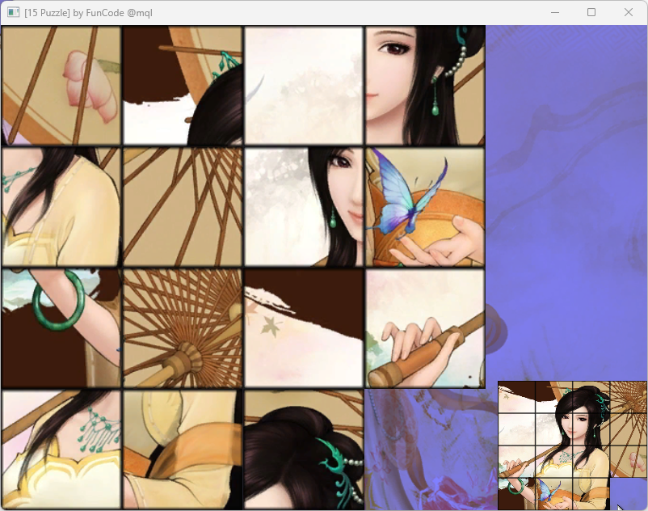

# 15puzzle@funcode

玩家可以通过鼠标单击相邻的空位方块，使其移动，最终将被打乱的图片恢复成完整图案。游戏的具体要求如下：

1.  **游戏启动与初始化**
    -   游戏启动后，显示初始界面。
    -   玩家按下空格键进入游戏，系统将完整图片分割为 15 个大小相等的方块，并随机打乱摆放，形成游戏初始状态。
2.  **游戏操作**
    -   进入游戏后，玩家可以通过鼠标单击相邻的空位方块，使其移动到空位处。
    -   只有与空位相邻的方块可以移动，玩家需逐步调整方块位置，最终拼出完整的图案。
    -   当方块排列恢复至目标状态（右下角留空），游戏判定胜利，并返回初始界面。
3.  **游戏原理**
    -   采用 `4×4` 的矩阵（二维数组）来表示游戏方块位置。
    -   前 15 个方块的编号按顺序为 `1~15`，第 16 个格子为空（编号 `0`）。
    -   游戏初始化时，系统会随机打乱这些编号，并确保至少存在一种可解路径。
    -   `0` 代表空位，只有与 `0` 相邻的方块可以移动至空位。
4.  **交互规则**
    -   玩家单击鼠标左键即可移动方块，每次只能移动一格。
    -   只有当鼠标位于可移动方块的范围内，点击才会生效。
