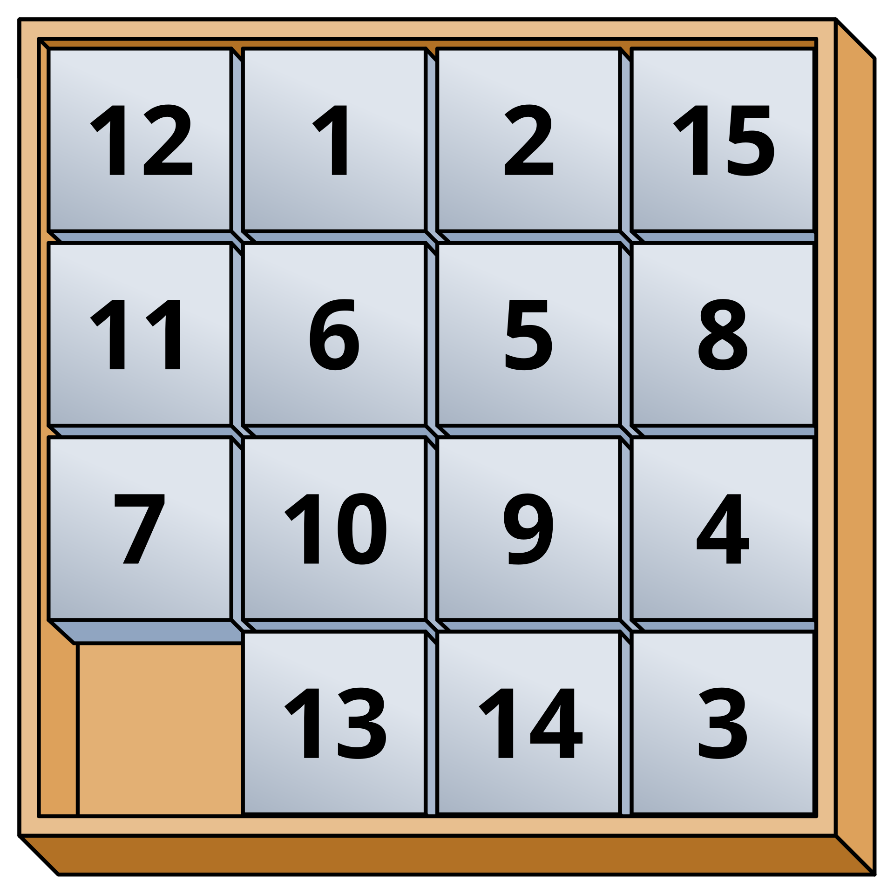
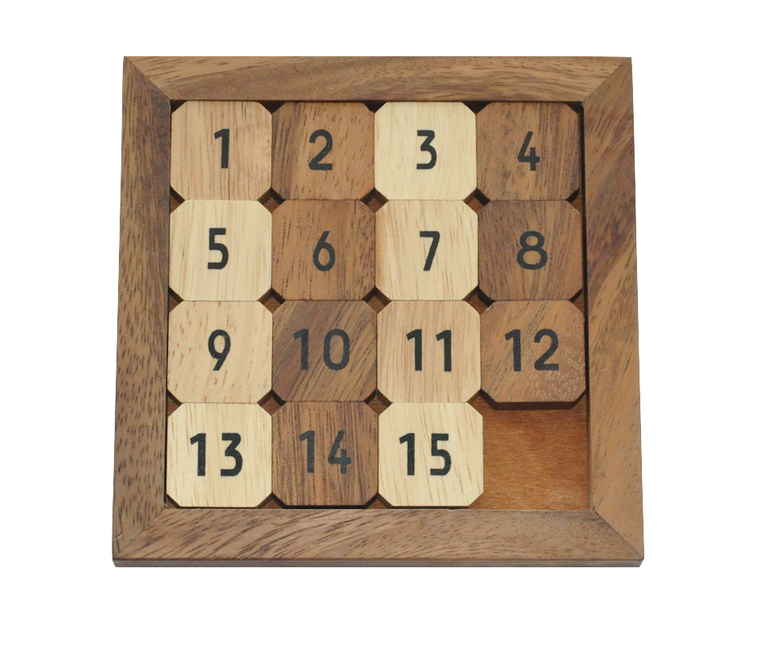

# 课程设计报告

## 1. 问题简介

本次课程设计为期两周，目标是利用FunCode游戏引擎，使用C++语言完成一款轻量小游戏的开发。每位同学抽到的课题不尽相同，而我抽到的则是一款滑块拼图游戏。

在着手开发之前，我首先进行了资料的整理与收集，概述如下：

1.   首先建立项目文件夹，命名为“25sp-cd-cpp-funcode”（“cd”取自comprehensive design 的缩写）。整理老师下发的资料压缩包，确定了项目文件夹的组织结构。目录如下：
     1.   需要提交的电子文档文件夹，按“学号-姓名-程序设计语言综合设计”的要求命名；
     2.   “apps”：存放用到的相关软件；
     3.   “docs”：存放相关文档；
     4.   “refs”：存放参考网页的链接；
     5.   “res”：存放相关资源。
2.   紧接着，我开始在网络上检索FunCode的相关信息，学习FunCode游戏引擎的使用，在B站上找到了一些教学视频，并存档在“refs”文件夹中。总的来说，互联网上关于FunCode的资料相当之少，关于FunCode的进一步介绍，详见1.1。
3.   最后，我仔细阅读了相关文档，如《课程设计报告书写要求》、《课程设计提交材料说明》，以及对应的任务书、实验指导手册、类库接口文档，并将这些文档进行了整理。

在完成资料的收集整理后，我清楚了解了本次课设的要求以及需要去解决的问题。与此同时，我也对该类型的滑块拼图游戏进行了检索，深入的了解了相关背景知识。

滑块游戏是一类在平面上滑动方块以组成特定排列的智力游戏。常见的滑块游戏包括数字拼图、华容道和塞车时间。其中15拼图（15 Puzzle）是最古老的滑块类游戏，发明者是 Noyes Chapman，该游戏风靡于1880年代。不像其它tour类的解谜游戏，滑块游戏禁止任何一个方块离开盘面，这个特性区别于重新排列类的解谜游戏。



而我本次课程设计的目标就是完成这样一个滑块拼图游戏的开发。玩家通过鼠标单击移动拼图方块，以正确拼合一幅被打乱的图片。游戏的主要逻辑是基于15拼图算法，该算法利用一个4×4的矩阵来记录游戏状态。



### 1.1 Funcode游戏引擎介绍

Funcode是一款简易的游戏引擎，类似近几年比较热门的Scratch，但较之更加古早。该引擎提供了可视化的编程环境、事件驱动机制及简化的UI控件，适用于初学者快速开发交互式游戏应用。本次课程设计主要利用Funcode处理界面渲染、事件监听（键盘、鼠标）、矩阵数据操作与状态管理。

### 1.2 滑块拼图游戏功能介绍

本游戏包含以下主要功能：

-   **游戏启动**：按下空格键进入游戏。
-   **拼图打乱**：将拆分后的拼图随机排列。
-   **拼图移动**：玩家可单击拼图方块以和相邻的空白方块交换位置。
-   **胜利判断**：完成拼图后，游戏检测成功并返回初始界面。
-   **鼠标交互**：仅允许鼠标左键单击有效的拼图方块（四周有空白方块）进行移动。

### 1.3 任务分析

该游戏的主要任务分为以下几个步骤：

1.  游戏初始化：
    -   显示游戏初始界面，等待玩家按下空格键开始游戏。
    -   将完整的图片分割为 15 块，并随机排列，同时预留一个空白方块（索引值 0）。
2.  游戏交互：
    -   监听鼠标单击事件。
    -   如果单击的拼图方块与空白方块相邻，则交换它们的位置。
    -   持续执行交换操作，直至玩家完成拼图。
3.  胜利判断：
    -   检查当前矩阵排列是否与正确排序相匹配。
    -   如果匹配，则返回游戏初始界面。

### 1.4 知识点概述

本次课程设计涉及到如下知识点：

-   **二维数组（矩阵）**：用于存储和管理4×4拼图方块的状态。
-   **事件驱动编程**：监听并处理鼠标和键盘输入。
-   **随机算法**：用于游戏初始化时打乱拼图。
-   **GUI设计**：处理游戏界面以及图像渲染。
-   **游戏逻辑控制**：包括拼图方块的移动规则、检测游戏胜利的逻辑。
-   **C++编程规范**：了解对于复杂项目，应当遵循的编码规范和命名规范等。
-   **C++项目组织**：了解多文件的C++项目如何组织、管理以及通信。
-   **代码管理**：尝试使用Git和Github来进行代码管理。

## 2. 设计思路

### 2.1 总体思路

FunCode游戏引擎采用了面向对象的设计方法，提供了一套游戏精灵库。该类库各个类分工明确，协同完成游戏逻辑，适用于2D游戏的开发。该引擎主要实现了精灵的基本操作，如移动、缩放、碰撞检测、动画播放、特效管理和音效处理等。

根据上一节的问题分析，在仔细阅读本次课程设计对应的指导任务书之后，明确了利用FunCode游戏引擎完成该滑块拼图游戏的总体思路：

```
+-----------------+
|    游戏初始化     |
+-----------------+
         ↓
+-----------------+
|     打乱拼图      |
+-----------------+
         ↓
+-----------------+
|    监听玩家操作   |
+-----------------+
         ↓
+-----------------+
|    更新游戏状态   |
+-----------------+
         ↓
+-----------------+
|     胜利判断     |
+-----------------+
         ↓
+-----------------+
|  游戏结束或继续   |
+-----------------+
```

其中，涉及到的重要数据结构是二维数组。为了完成该游戏的开发，需要利用一个二维数组来记录并更新拼图的排列信息，并通过与正确排序进行比较，以此来判断图片是否已经被正确拼合。

通过阅读FunCode的文档和游戏的初始模板代码，也了解到了FunCode游戏引擎运行的主要流程，如下：

```
+-----------------+
|     游戏初始化    |
+-----------------+
         ↓
+-----------------+
|      加载资源     |
+-----------------+
         ↓
+-----------------+
|      处理输入     |
+-----------------+
         ↓
+-----------------+
|    更新精灵状态   |
+-----------------+
         ↓
+-----------------+
|      碰撞检测     |
+-----------------+
         ↓
+-----------------+
|      渲染精灵     |
+-----------------+
         ↓
+-----------------+
|      播放音效     |
+-----------------+
         ↓
+-----------------+
|      游戏循环     |
+-----------------+
```

### 2.2 设计表示

经过分析，针对该游戏，并不需要设计新的类，只需在已有的GameMain类中新增合适的成员变量和成员函数即可。

首先按照编程规范重新组织GameMain类的结构如下：

```cpp
//===================================================================
// NAME        : CGameMain
//
// DESCRIPTION : 游戏总管类。负责游戏初始化、运行、循环及结束等逻辑。
// AUTHOR      : mql
// DATE        : 250221
//===================================================================
class CGameMain
{
// methods
//-------------------------------
public :
protected :
private :
// attributes
//-------------------------------
public :
protected :
private :
};
```

其中，需要新增的成员变量如下：

```cpp
// "空格开始"精灵
CSprite *m_spGameBegin;
// 4x4 矩阵位置参数
static const float m_fBlockSize;   // 拼图大小
static const float m_fBlockStartX; // 拼图起始X坐标
static const float m_fBlockStartY; // 拼图起始Y坐标
// 拼图数组
CSprite *m_spBlock[BLOCK_COUNT * BLOCK_COUNT];
// 拼图状态矩阵
int m_iBlockState[BLOCK_COUNT][BLOCK_COUNT];
```

| 数据成员       | 作用描述       | 数据类型           |
| -------------- | -------------- | ------------------ |
| m_spGameBegin  | "空格开始"精灵 | CSprite *          |
| m_fBlockSize   | 拼图大小       | static const float |
| m_fBlockStartX | 拼图起始X坐标  | static const float |
| m_fBlockStartY | 拼图起始Y坐标  | static const float |
| m_spBlock      | 拼图数组       | CSprite *          |
| m_iBlockState  | 拼图状态矩阵   | int                |

需要新增的成员函数如下：

```cpp
// 处理键盘按键
void OnKeyDown(const int iKey, const bool iAltPress, const bool iShiftPress, const bool iCtrlPress);
// 处理鼠标点击
void OnMouseClick(const int iMouseType, const float fMouseX, const float fMouseY);

// 索引转换 (二维坐标 -> 一维索引)
int XYToOneIndex(const int iIndexX, const int iIndexY);
// 索引转换 (一维索引 -> 二维X坐标)
int OneIndexToX(const int iIndex);
// 索引转换 (一维索引 -> 二维Y坐标)
int OneIndexToY(const int iIndex);

// 移动拼图到指定位置
void MoveSpriteToBlock(CSprite* tmpSprite, const int iIndexX, const int iIndexY);
// 判断游戏是否获胜
bool IsGameWin();
```

由于该游戏需要充分使用FunCode引擎提供的类库，因此也对FunCode引擎的类库设计进行梳理、总结如下：

| 类名           | 作用描述                                     |
| -------------- | -------------------------------------------- |
| CSprite        | 精灵基类，提供基础精灵操作，如移动、缩放等   |
| CStaticSprite  | 静态精灵类，不包含动画，仅用于背景或装饰元素 |
| CAnimateSprite | 动画精灵类，支持帧动画，如角色、敌人等       |
| CTextSprite    | 文字精灵类，用于显示文本信息，如分数、提示等 |
| CEffect        | 特效精灵类，管理爆炸、火焰等视觉效果         |
| CSound         | 声音管理类，控制游戏音效和背景音乐           |
| CSystem        | 系统管理类，处理窗口管理、输入事件等         |

类名均按照编程规范，由两部分构成，即“<C><标识符>” ，其中“C”表示“class”。

### 2.3 详细设计

接下来分析游戏的主要逻辑和相关算法实现，并附录使用到的函数接口。

#### 2.3.1 游戏初始化

**目标**：按下空格键后，提示信息消失，游戏开始，拼图被随机打乱。

**思路**：

系统会自动调用 `Main.cpp` 的 `OnKeyDown` 函数监听并响应键盘按键事件，所以当空格键被按下时，游戏应当启动。需要在处理键盘按键的函数下修改控制游戏状态的变量 `m_iGameState` ，使之从未开始状态（0）切换到游戏开始状态（1），并隐藏初始界面中提示游戏开始的信息。

其次，需要一个4x4的二维数组来记录每块拼图的编号排列，其中15个元素用来存储拼图（编号1-15），1个元素留空（编号0），数组名按照命名规范命名为 `m_iBlockState` ，作为 `GameMain` 的成员变量。

接着要思考拼图被随机打乱的算法应该如何实现。仔细思考后，考虑到可以先初始化一个存储1-15整数的数组 `iRandData`，接着从中随机选取一个值，赋给 `m_iBlockState`，以此来表示对应编号的拼图。 `iRandData` 数组在选择好某个值之后，应当移动数组的剩余元素来删除已选的值，防止重复赋值。

另外，需要一个拼图数组 `m_spBlock` 来存储 `CSprite` 对象，结合 `MoveSpriteToBlock` 函数，以将拼图渲染到指定位置。在这个过程中，需要使用一个索引转换函数 `XYToOneIndex` 来实现一维数组 `m_spBlock` 和二维数组 `m_iBlockState` 之间的正确映射。

下面详细记录了实现了4x4拼图矩阵随机初始化的过程，确保了每块拼图不会被重复渲染。通过索引转换，能够在一维和二维数组之间高效操作，使初始化更高效可靠。

##### 2.3.1.1 按下空格，开始游戏

在 `LessonX.h` 中声明：

```cpp
// "空格开始"精灵
CSprite *m_spGameBegin;
```

```cpp
// 处理键盘按键事件
void OnKeyDown(const int iKey, const bool iAltPress, const bool iShiftPress, const bool iCtrlPress);
```

在 `LessonX.cpp` 的构造函数中初始化"空格开始"精灵：

```cpp
m_spGameBegin = new CSprite("GameBegin");
```

在 `LessonX.cpp` 中实现：

```cpp
//===================================================================
// NAME        : OnKeyDown
//
// DESCRIPTION : 处理键盘按键事件。
// AUTHOR      : mql
// DATE        : 250221
//===================================================================
void CGameMain::OnKeyDown(int iKey, bool iAltPress, bool iShiftPress, bool iCtrlPress)
{
	// 按下空格键且游戏未开始
	if (iKey == KEY_SPACE && m_iGameState == 0) {
		SetGameState(1);												// 切换成游戏开始状态
		m_spGameBegin->SetSpriteVisible(false);	// 隐藏"空格开始"精灵
	}  
}
```

需要注意的是：

- 空格键的键值为 `KEY_SPACE`。
- 仅当 `m_iGameState == 0` 时，按下空格键才会启动游戏。

在 `Main.cpp` 文件中，将系统的按键输入事件传递到 `OnKeyDown` 进行处理。

在 `OnKeyDown` 调用处添加：

```cpp
// 响应键盘按键事件
g_GameMain.OnKeyDown(iKey, bAltPress, bShiftPress, bCtrlPress);
```

##### 2.3.1.2 初始化相关数据

在 `LessonX.h` 中添加宏：

```cpp
// defines
//------------------------------
#define BLOCK_COUNT 4	// 定义拼图的数量 (4x4 矩阵)
```

在 `LessonX.h` 中声明：

```cpp
// 4x4 矩阵位置参数
static const float m_fBlockSize;   // 拼图大小
static const float m_fBlockStartX; // 拼图起始X坐标
static const float m_fBlockStartY; // 拼图起始Y坐标
// 拼图数组
CSprite *m_spBlock[BLOCK_COUNT * BLOCK_COUNT];
// 拼图状态矩阵
int m_iBlockState[BLOCK_COUNT][BLOCK_COUNT];
```

在 `LessonX.cpp` 中定义常量：

```cpp
// constants
//------------------------------
// 定义拼图的大小和起始坐标
const float CGameMain::m_fBlockSize = 18.75f;
const float CGameMain::m_fBlockStartX = -40.625f;
const float CGameMain::m_fBlockStartY = -28.125f;
```

在 `GameInit()` 中初始化随机数据：

```cpp
int iDataCount = BLOCK_COUNT*BLOCK_COUNT - 1;
// 初始化随机数据
int iRandData[BLOCK_COUNT*BLOCK_COUNT-1];
for (int i = 0; i < BLOCK_COUNT*BLOCK_COUNT-1; ++i) {
	iRandData[i] = i + 1;
}
```

##### 2.3.1.3 实现索引转换函数

在 `LessonX.h` 中声明：

```cpp
// 索引转换 (二维坐标 -> 一维索引)
int XYToOneIndex(const int iIndexX, const int iIndexY);
```

在 `LessonX.cpp` 实现：

```cpp
//===================================================================
// NAME        : XYToOneIndex
//
// DESCRIPTION : 索引转换 (二维坐标 -> 一维索引)。
// AUTHOR      : mql
// DATE        : 250221
//===================================================================
int CGameMain::XYToOneIndex(int iIndexX, int iIndexY)
{
    return (iIndexY * BLOCK_COUNT + iIndexX);
}
```

##### 2.3.1.4 随机打乱拼图

```cpp
// 遍历状态矩阵并随机打乱拼图
for (int y = 0; y < BLOCK_COUNT; ++y) {
    for (int x = 0; x < BLOCK_COUNT; ++x) {
        // 获取一维索引
        int iIdx = XYToOneIndex(x, y);
        // 配置空白方块
        if (x == BLOCK_COUNT - 1 && y == BLOCK_COUNT - 1) {
            m_iBlockState[y][x] = 0;
            m_spBlock[iIdx] = new CSprite("NULL");
        } else {
            int randIdx = CSystem::RandomRange(0, iDataCount - 1);  // 随机选择编号
            m_iBlockState[y][x] = iRandData[randIdx];               // 绑定随机编号
            char *szSpName = CSystem::MakeSpriteName("PictureBlock", m_iBlockState[y][x]);
            m_spBlock[iIdx] = new CSprite(szSpName);                // 绑定对应拼图
            MoveSpriteToBlock(m_spBlock[iIdx], x, y);               // 重新渲染拼图
            // 移动剩余数据，防止重复赋值
            for (int i = randIdx; i < iDataCount - 1; ++i)
                iRandData[i] = iRandData[i + 1];
            iDataCount--;
        }
    }
}
```

##### 2.3.1.4 实现移动拼图到指定位置的函数

在 `LessonX.h` 中声明：

```cpp
// 移动拼图到指定位置
void MoveSpriteToBlock(CSprite* tmpSprite, const int iIndexX, const int iIndexY);
```

在 `LessonX.cpp` 中实现：

```cpp
//===================================================================
// NAME        : MoveSpriteToBlock
//
// DESCRIPTION : 移动拼图到指定位置。
// AUTHOR      : mql
// DATE        : 250221
//===================================================================
void CGameMain::MoveSpriteToBlock(CSprite *sp, int iIndexX, int iIndexY)
{
    float fPosX = m_fBlockStartX + iIndexX * m_fBlockSize;
    float fPosY = m_fBlockStartY + iIndexY * m_fBlockSize;
    sp->SetSpritePosition(fPosX, fPosY);
}
```

#### 2.3.2 滑动拼图

**目标**：实现使用鼠标单击相邻空白格的拼图以进行滑动。

**思路**：首先获取鼠标单击事件，然后判断鼠标点击的是否是某块拼图，若是，继续判断这块拼图是否相邻空格，若是，则滑动拼图。在这个过程中，同样需要使用索引转换，来将记录拼图状态的二维矩阵坐标与存储拼图数组的一维索引进行映射，以确保拼图可以正确地滑动到相邻的空格上。

##### 2.3.2.1 实现处理鼠标点击事件的函数

在 `LessonX.h` 中声明：

```cpp
// 处理鼠标点击事件
void OnMouseClick(const int iMouseType, const float fMouseX, const float fMouseY);
```

在 `LessonX.cpp` 中实现：

```cpp
//===================================================================
// NAME        : OnMouseClick
//
// DESCRIPTION : 处理鼠标点击事件。
// AUTHOR      : mql
// DATE        : 250221
//===================================================================
void CGameMain::OnMouseClick(const int iMouseType, const float fMouseX, const float fMouseY) {
    // 只处理游戏进行中的鼠标点击事件
    if (m_iGameState != 2) return;
    // 初始化鼠标点击的拼图索引
    int iClickIdx = -1;
    // 遍历拼图数组获取鼠标点击的拼图索引
    for (int iLoop = 0; iLoop < BLOCK_COUNT * BLOCK_COUNT; iLoop++) {
        if (m_spBlock[iLoop]->GetName() == "NULL") continue;
      	// 使用`IsPointInSprite`判断鼠标是否点击了某块拼图，若是，则`iClickIdx`记录下该索引
        if (m_spBlock[iLoop]->IsPointInSprite(fMouseX, fMouseY)) {
            iClickIdx = iLoop;
            break;
        }
    }
    // 未获取到具体索引
    if (iClickIdx == -1) return;
    // 获取一维索引对应的二维坐标
    int iIdxX = OneIndexToX(iClickIdx);
    int iIdxY = OneIndexToY(iClickIdx);
    // 初始化空白格坐标
    int iEmptyIdxX = -1, iEmptyIdxY = -1;
    // 判断点击的拼图周围是否有相邻的空白格
    if (iIdxX > 0 && m_iBlockState[iIdxY][iIdxX - 1] == 0) {
        // left
        iEmptyIdxX = iIdxX - 1;
        iEmptyIdxY = iIdxY;
    }
    else if (iIdxX < BLOCK_COUNT - 1 && m_iBlockState[iIdxY][iIdxX + 1] == 0) {
        // right
        iEmptyIdxX = iIdxX + 1;
        iEmptyIdxY = iIdxY;
    }
    else if (iIdxY > 0 && m_iBlockState[iIdxY - 1][iIdxX] == 0) {
        // top
        iEmptyIdxX = iIdxX;
        iEmptyIdxY = iIdxY - 1;
    }
    else if (iIdxY < BLOCK_COUNT - 1 && m_iBlockState[iIdxY + 1][iIdxX] == 0) {
        // bottom
        iEmptyIdxX = iIdxX;
        iEmptyIdxY = iIdxY + 1;
    }
    // 无法找到相邻的空白格
    if (iEmptyIdxX == -1 || iEmptyIdxY == -1) return;
    // 更新矩阵状态
    int tempState = m_iBlockState[iIdxY][iIdxX];
    m_iBlockState[iIdxY][iIdxX] = m_iBlockState[iEmptyIdxY][iEmptyIdxX];
    m_iBlockState[iEmptyIdxY][iEmptyIdxX] = tempState;
    // 更新拼图数组
    int iOneIdx = XYToOneIndex(iEmptyIdxX, iEmptyIdxY);
    CSprite *spTmp = m_spBlock[iClickIdx];
    m_spBlock[iClickIdx] = m_spBlock[iOneIdx];
    m_spBlock[iOneIdx] = spTmp;
    // 重新渲染拼图
    MoveSpriteToBlock(m_spBlock[iOneIdx], iEmptyIdxX, iEmptyIdxY);
}
```

##### 2.3.2.2 实现索引转换函数

在 `LessonX.h` 中声明：

```cpp
// 索引转换 (一维索引 -> 二维X坐标)
int OneIndexToX(const int iIndex);
// 索引转换 (一维索引 -> 二维Y坐标)
int OneIndexToY(const int iIndex);
```

在 `LessonX.cpp` 中实现：

```cpp
//===================================================================
// NAME        : OneIndexToX
//
// DESCRIPTION : 索引转换 (一维索引 -> 二维X坐标)。
// AUTHOR      : mql
// DATE        : 250221
//===================================================================
int CGameMain::OneIndexToX(int iIndex)
{
    return (iIndex % BLOCK_COUNT);
}

//===================================================================
// NAME        : OneIndexToY
//
// DESCRIPTION : 索引转换 (一维索引 -> 二维Y坐标)。
// AUTHOR      : mql
// DATE        : 250221
//===================================================================
int CGameMain::OneIndexToY(int iIndex)
{
    return (iIndex / BLOCK_COUNT);
}
```

##### 2.3.2.3 响应鼠标点击事件

在 `Main.cpp` 响应鼠标点击事件：

```cpp
// 响应鼠标点击事件
g_GameMain.OnMouseClick(iMouseType, fMouseX, fMouseY);
```

#### 2.3.3 胜利判断

**目标**：当图片被正确拼合后，游戏自动判定胜利。

**思路**：需要实现一个判断游戏胜利的函数，并在游戏主循环中调用该函数以实时判断游戏状态。判断游戏是否胜利的核心逻辑是，所有拼图是否按照1-15的顺序排列，并且最后一个位置为空格，即值为0。如果检测到胜利，则应该结束游戏并返回游戏初始界面。

##### 2.3.3.1 实现判断游戏是否获胜的函数

在 `LessonX.h` 中声明：

```cpp
// 判断游戏是否获胜
bool IsGameWin();
```

在 `LessonX.cpp` 中实现：

```cpp
//===================================================================
// NAME        : IsGameWin
//
// DESCRIPTION : 判断游戏是否获胜。
// AUTHOR      : mql
// DATE        : 250221
//===================================================================
bool CGameMain::IsGameWin()
{
    int iSN = 1;	// 拼图索引

    for (int y = 0; y < BLOCK_COUNT; ++y) {
        for (int x = 0; x < BLOCK_COUNT; ++x) {
            // 判断最后一个位置是否是空白格
            if (x == BLOCK_COUNT - 1 && y == BLOCK_COUNT - 1)
                return (m_iBlockState[y][x] == 0);
            // 判断排列，若值不符合预期，则游戏未胜利
            if (m_iBlockState[y][x] != iSN++)
                return false;
        }
    }

    return true;
}
```

核心逻辑如下：

-   使用两个 `for` 循环遍历二维数组 `m_iBlockState`。
-   检查前 15 个元素是否依次递增（即 `1, 2, ..., 15`）。
-   第 16 个元素应为 0。
-   如果遍历过程中发现任意一个元素不符合条件，立即返回 `false`（未胜利）。
-   若所有条件满足，则返回 `true`（胜利）。

##### 2.3.3.2 在游戏主循环中检测游戏胜利状态

需要一直检测游戏状态，在 `GameMainLoop` 中修改 `GameRun` 调用。

- 原代码：

  ```cpp
  if (true) {
      GameRun(fDeltaTime);
  }
  ```

- 修改为：

  ```cpp
  if (!IsGameWin()) {
      GameRun(fDeltaTime);
  }
  ```

##### 2.3.3.3 处理游戏胜利后的逻辑

如果游戏胜利，则执行 `GameEnd` 函数。在 `GameEnd` 函数中添加以下代码，以显示游戏开始提示：

```cpp
// 显示提示开始的“空格开始”精灵
m_spGameBegin->SetSpriteVisible(true);
```

## 3. 上机调试过程

调试过程中遇到的主要问题，分析原因并给出解决思路；对设计和编码的回顾讨论和分析。

---

由于进行了比较细致的问题分析，所以在调试过程中，除了输入错误，并没有其他大的调试问题。但是在完成游戏的开发后，遇到了 15 puzzle 算法可解性的问题。发现之前随机打乱的拼图，并不总是能够复原的。为了解决这一问题，就要对之前的随机打乱算法进行一些改进。

通过查阅资料，首先厘清15拼图的可解性规则。

### 3.1 15拼图的可解性规则

15拼图只有在以下条件满足时才可解：

-   逆序对数（Inversion Count）：
    -   计算整个拼图的逆序对数（inversion count）。逆序对是指在一维展开的拼图状态中，较大的数字出现在较小数字前面的情况。
    -   例如，在 `4×4` 拼图中，如果排列为 `[1, 2, 3, 4, 5, 6, 7, 8, 9, 10, 11, 12, 13, 15, 14, 0]`，其中 `15` 出现在 `14` 之前，这是一个逆序对。
    -   如果逆序数是偶数，则该拼图可解，否则不可解。
-   空白块的行数位置：
    -   需要计算空白块（0）的行号（从下往上数）。
    -   在 4×4 拼图中：
        -   如果行号是偶数，则逆序数必须是奇数（不可解）。
        -   如果行号是奇数，则逆序数必须是偶数（可解）。

在该游戏中，由于空白块固定在最后一行的最后一列，所以空白块的行号是计数，那么这个拼图当中，逆序对数必须是偶数。

### 3.2 改进随机打乱算法

#### 3.2.1 实现判断15拼图可解性的函数

在 `LessonX.h` 中声明：

```cpp
// 判断15拼图是否可解
bool IsSolvable(int m_iBlockState[BLOCK_COUNT][BLOCK_COUNT]);
```

在 `LessonX.cpp` 中实现：

```cpp
//===================================================================
// NAME        : IsSolvable
//
// DESCRIPTION : 判断15拼图是否可解。
// AUTHOR      : mql
// DATE        : 250224
//===================================================================
bool CGameMain::IsSolvable(int m_iBlockState[BLOCK_COUNT][BLOCK_COUNT])
{
    int iInversionCount = 0;
    int iFlatPuzzle[BLOCK_COUNT * BLOCK_COUNT]; // 将 4x4 矩阵转换成一维数组
    int iIdx = 0;
    int iEmptyRow = 0;

    // 转换拼图为一维数组，并记录空白块所在行号（从上往下数）
    for (int y = 0; y < BLOCK_COUNT; ++y) {
        for (int x = 0; x < BLOCK_COUNT; ++x) {
            iFlatPuzzle[iIdx] = m_iBlockState[y][x];
            if (m_iBlockState[y][x] == 0) {
                iEmptyRow = y; // 记录空白块行号
            }
            iIdx++;
        }
    }

    // 双指针计算逆序对数
    for (int i = 0; i < BLOCK_COUNT * BLOCK_COUNT - 1; ++i) {
        for (int j = i + 1; j < BLOCK_COUNT * BLOCK_COUNT; ++j) {
            if (iFlatPuzzle[i] > iFlatPuzzle[j] && iFlatPuzzle[i] != 0 && iFlatPuzzle[j] != 0) {
                iInversionCount++;
            }
        }
    }

    // 计算空白格所在行（从下往上数）
    int iBlankRowFromBottom = BLOCK_COUNT - iEmptyRow;

    // 15拼图可解性规则：一奇一偶
    return (iInversionCount % 2 == 0) == (iBlankRowFromBottom % 2 == 1);
}
```

#### 3.2.2 修改拼图初始化

在 `LessonX.h` 中声明：

```cpp
// 生成可解的随机拼图
void GenerateSolvablePuzzle();
```

在 `LessonX.cpp` 实现：

```cpp
//===================================================================
// NAME        : GenerateSolvablePuzzle
//
// DESCRIPTION : 生成一个可解的 15 拼图，并确保空白格在 (3,3)。
// AUTHOR      : mql
// DATE        : 250224
//===================================================================
void CGameMain::GenerateSolvablePuzzle()
{
    // 填充随机数据
    int iRandData[BLOCK_COUNT * BLOCK_COUNT - 1];  // 存储1-15的编号
    for (int i = 0; i < BLOCK_COUNT * BLOCK_COUNT - 1; ++i) {
        iRandData[i] = i + 1;
    }

    do {
        // 使用 Fisher-Yates 洗牌算法随机打乱拼图
        for (int i = BLOCK_COUNT * BLOCK_COUNT - 2; i > 0; --i) {
            int j = CSystem::RandomRange(0, i); // 生成 0~i 之间的随机索引
            std::swap(iRandData[i], iRandData[j]);
        }
        // 将打乱的拼图填充到 4x4 矩阵中
        int iIdx = 0;
        for (int y = 0; y < BLOCK_COUNT; ++y) {
            for (int x = 0; x < BLOCK_COUNT; ++x) {
                if (y == BLOCK_COUNT - 1 && x == BLOCK_COUNT - 1) {
                    m_iBlockState[y][x] = 0; // 预留最后一格为空白格
                } else {
                    m_iBlockState[y][x] = iRandData[iIdx++];
                }
            }
        }
    } while (!IsSolvable(m_iBlockState)); // 重新生成直到满足可解性
}
```

#### 3.2.3 修改 `GameInit()`

```cpp
//===================================================================
// NAME        : GameInit
//
// DESCRIPTION : 游戏初始化。生成并打乱拼图方块。
// AUTHOR      : mql
// DATE        : 250224
//===================================================================
void CGameMain::GameInit()
{
    // 生成可解的拼图
    GenerateSolvablePuzzle();
    // 绑定拼图到精灵
    for (int y = 0; y < BLOCK_COUNT; ++y) {
        for (int x = 0; x < BLOCK_COUNT; ++x) {
            int iBlockValue = m_iBlockState[y][x];

            int iIdx = XYToOneIndex(x, y); // 获取一维索引

            if (iBlockValue == 0) {
                m_spBlock[iIdx] = new CSprite("NULL"); // 空白块
            } else {
                char *szSpName = CSystem::MakeSpriteName("PictureBlock", iBlockValue);
                m_spBlock[iIdx] = new CSprite(szSpName);
            }

            // 重新渲染拼图
            MoveSpriteToBlock(m_spBlock[iIdx], x, y);
        }
    }
}
```

## 4. 系统测试

对该游戏系统的子功能逐一测试，测试结果如下：

### 4.1 游戏初始化

-   游戏系统启动：正常

-   启动后显示初始界面：正常

-   按下空格键后，拼图被随机打乱：正常

### 4.2 拼图滑动

-   使用鼠标单击相邻空白格的拼图以进行滑动：正常

### 4.3 胜利判断

-   当所有拼图按正确顺序排列后，游戏系统自动判定胜利并返回初始界面

测试结果表明，所有子功能均按可以按照预期运行，总体功能正常，未发现严重 bug。

## 5. 用户手册

1.  **启动游戏**：运行程序后，按下空格键进入游戏。
2.  **滑动拼图**：使用鼠标单击相邻空白格的拼图以进行滑动。
3.  **游戏胜利**：当所有拼图按正确顺序排列后，游戏自动判定胜利。

## 6. 小结

通过本次课程设计，我更加深刻地理解了面对对象编程的基本思想，并能够熟练地运用类和对象的概念。通过学习C++编程规范，对于复杂项目的文件组织以及命名规范有了更好的把握。我也学习到了游戏开发的基本逻辑，了解了事件驱动编程模型。在这个过程中，我的代码组织能力得到了提高。

与此同时，这个游戏还有很大的改进空间，比如缺少计时和步数统计功能，仅支持单人模式、不支持联网对战和排行榜功能，在界面设计方面，游戏的UI设计也比较简单，用户体验不是很好。这些都是可以改进的地方，还需要我进一步提高编程能力、对复杂项目的组织能力以及界面设计的能力。

在完成这次课程设计的过程中，我使用了Github进行代码管理，并通过整理相关资料、文档，也提高了项目文件的组织能力。我也发现了自己对C++的运用还不够熟练和扎实，仍然需要在课外多思考多实践。

## 7. 参考文献
